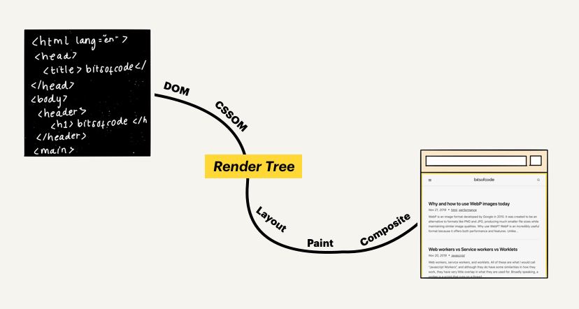

🤷🏻‍♀️ 엄마 가지 - 1월 06일에 작성한'(React) 렌더링을 언제 하길래 데이터 변경이 안돼?' 포스팅에서  
렌더링의 뜻을 정의하였다. 렌더링이란 '리액트 앨리먼트를 html 형태로 변환하여 화면에 그려지는 것.'
정확히 앨리먼트라는 게 뭘까?하면서 알아보는 글

 
속 시원하게 먼저 앨리먼트가 뭐냐면,

## Element와 React Element  
Element란 html에서 태그로 적은 노드들을 지칭한다.  
React Element는 React내에서 html에서 태그로 적은 노드를 지칭한다.  
 

## 궁금증 해결
이렇게되면 렌더링의 정의가 틀린 것이다.  
신뢰성을 블로그를 봐야하는 이유이다.  
다시 렌더링을 다시 정의하면 'HTML파일을 읽어 브라우저에 출력하는 과정'이다.  

### ❓ 추가 궁금증 - Html파일을 읽어와서 화면에 띄워주는 과정
1. 브라우저가 HTML과 CSS를 파싱하여 화면에 어떤 것이 보여지게 되는지 결정하는 과정  
2. 브라우저가 렌더링을 하는 과정  

* 1번 과정을 거치면 렌더트리가 만들어진다.
* 렌더트리는 화면에 보여지게되는 HTML Element(DOM)와 그에 대응하는 스타일(CSSOM)을 표현한다.
* 렌더트리가 만들어지면 2번의 과정을 거치게 된다.

### ❓ 추가 궁금증 - Node와 Element 차이점
: Node의 특정타입 Node.Element가 Element이다.  (Node 타입에는 Node.COMMENT_NODE, Node.TEXT_NODE 등등 많다.)
* Element는 html에서 태그로 적은 노드들을 지칭한다.  

* Node는 주석이나 text와 같은 것들도 포함한다.

