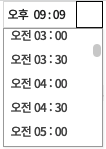

## scrollHeight returns 0   
- javascript파일에서 jquery를 사용하여, element를 가져와 scrollHeight를 얻고자 함.
- $(element).prop('scrollHeight');
- 그런데 계속 0이 찍히는 것이다.

**문제의 상황**  
그림과 같이 scrollBox는 TimePickerBox를 클릭할 때 열렸다 닫히는데, 
scrollBox의 display가 none인 상황에서 scrollHeight를 check했다.



## 해결의 과정
 a. 구글링을 한다.   
https://stackoverflow.com/questions/8100099/checking-for-scrollheight-of-an-element-sometimes-returning-0
 
 b. stack overflow의 답변 요약  
 It had to do with the what I was trying to check after different elements were set to display none.   

 element들의 display가 none으로 설정후에 scrollHeight를 확인하려고 하는 것과 관련이 있다.  

 c. scrollBox가 display block 상태 전환 이후 scrollHeight를 체크한다.  
 ```
 $timePicker.on('click', function (e) {
                    $(this).siblings().addClass("active");
                    $timePickerListBox.children().slideDown(200);

                    var scrollBox = _thisPlugin.$timePickerListBox.children()[0],
                        scrollHeight = scrollBox.scrollHeight,
                        clientHeight = scrollBox.clientHeight,
                        listId = '';
                        console.log(scrollBox.scrollTop = 150);
                }
            })
 ```
 d. 짜증내면서 기뻐한다.  

 

