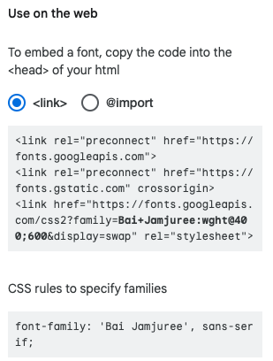

* 계속해서 추가됩니다.  
이 페이지를 보면 알 수 있는 것  
    1.  웹 폰트 적용  
    2.  웹 폰트 굵기 적용


-- 웹 폰트 적용

**Google Font**
https://fonts.google.com/



1. 링크 태그로 해당 웹폰트 가져오기

```
<head>
    <link rel="preconnect" href="https://fonts.googleapis.com">
    <link rel="preconnect" href="https://fonts.gstatic.com" crossorigin>
    <link href="https://fonts.googleapis.com/css2?family=Bai+Jamjuree:wght@400;600&display=swap" rel="stylesheet">
</head>
```

2. css 적용하기
```
body {
      font-family: 'Bai Jamjuree', sans-serif;
    }
```


-- 웹 폰트 굵기 적용

1. link태그의 href속성에 wght@400;600 지정을 해주어야 함.

2. 웹 폰트 적용
```
.font {
    font-weight: 600;
}
```