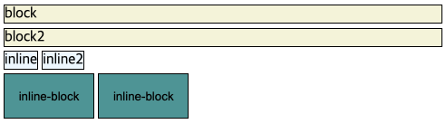
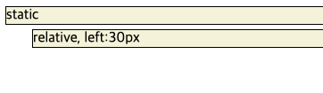
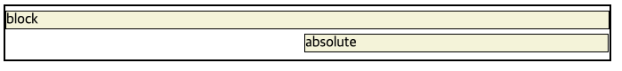

무작정 CSS를 적용하고자 했을 때 가장 헷갈렸던 두 가지의 속성을 정리해보려고 한다.  
퍼블리싱을 하고자 한다면 display와 position을 보게 될 것이다.  
~~보지 못했다면 퍼블리싱을 한 것이 아니다.~~  

display는 웹페이지의 레이아웃을 결정하는 CSS의 중요한 속성이고,  
position은 레이아웃 안에서 HTML요소의 구체적인위치를 결정하는 속성이다.  
그러면 두 가지 속성을 조금 자세히 살펴보자.

### display

display속성의 값으로는 아래 세 가지 뿐이다.
1. block
2. inline
3. inline-block

HTML의 모든 요소는 display의 속성 값을 가지는데 대부분, 1. block 혹은 2 inline을 가진다.

**block**
의 경우 `
, <h1>, 
, <ul>` 등이 있다.  
block은 말 그대로 레이아웃이 하나의 블럭(라인)을 차지한다. 즉 해당 라인의 너비를 모두 차지한다.

**inline**
의 경우 `, <a>, ` 가 있으며,  
하나의 라인을 차지하지 않고, HTML요소가 가진 너비만큼만 차지한다.

**inline-block**
의 경우 `<button>, <input>, <select>`가 있으며
inline과 같이 HTML요소가 가진 너비만큼만 차지하지만,  
inline에서 불가능하던 width와 height 속성 지정 및 margin과 padding 속성 등 상하 간격 지정이 가능하다.

이처럼 각 HTML 요소는 display 기본 속성 값을 가진다고 해도  
속성값을 변경함으로써, <b>개발자가 원하는 레이아웃을 결정할 수 있다.</b>

하지만 display 속성값을 변경해도, 해당 속성이 가진 모든 특징을 가지진 않는다.  
예를들어, ``의 display 속성값을 block으로 변경해도  
`` 내부에 다른 태그의 요소를 포함할 수는 없다.  
왜냐하면, display의 기본 속성 값이 block인 요소만이 내부에 다른 요소를 포함 할 수 있기 때문이다.

### position

position은 HTML요소의 위치 결정 방식을 설정하는 속성이다.
position속성의 값으로는 아래 네 가지 뿐이다.
1. static: 정적 위치 지정 
2. relative: 상대 위치 지정
3. fixed: 고정 위치 지정
4. absolute: 절대 위치 지정

position에도 기본 속성 값이 있는데, 모든 HTML요소의 위치 결정 방식은 static이다.

**static**  
정적 위치 지정방식인 static은 단순히 웹페이지의 흐름에 따라 차례대로 요소들을 위치시킨다.   
HTML요소의 position 속성값을 지정하지 않으면 static으로 지정된다.

**relative**  
HTML요소의 정적 위치에 따라 위치를 재조정하는 방식이다.  
<b>기준</b>: 해당 요소가 정적 위치 지정 의 위치에 상대적으로 위치함.

**fixed**  
뷰포트를 기준으로 위치를 설정하는 방식이다.  
즉, 웹 페이지가 스크롤 되어도, 고정 되어 항상 같은 곳에 위치한다.  
<b>기준</b>: 뷰포트에 상대적으로 위치함.  

**absolute**

뷰포트를 기준으로 위치를 설정하지만,  
뷰포트만의 기준이 아닌, 위치가 설정된 조상요소를 기준으로 위치를 설정하게 된다.  
기준 위치가 설정된 바로 상위의 조상 요소에 상대적으로 위치함.  

현재 absolute속성이 있는 div는 right: 1px 속성값을 주어, 오른쪽에 위치하게 되는데  
바로 상위의 조상 요소에 해당하는 div에 상대적으로 오른쪽에 위치한다.

