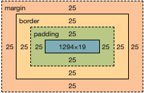
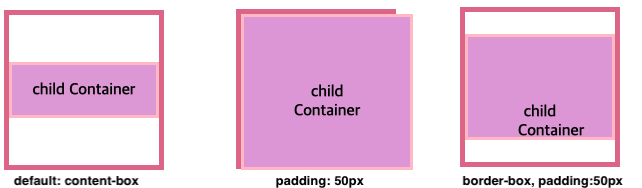

이론 -> 실무의 케이스로 CSS를 공부한게 아니여서,  
'CSS 박스 모델'개념이 얼마나 기초 중의 기초인지 몰랐다.  
매우 매우 타이니한 UI화면을 만들 때 조차도(!!) 
무조건 알아야 한다는 것을 세상 사람들에게 알리는 바이다.
이 내용을 블로깅한다는 것이 굉장히 쑥스러우나, 쑥스러움은 잠깐뿐.

왜 필요하냐하면, 한 div걸러 div에 주는 속성인 width와 height가 대체 어떤 영역에 주는 것인지는 알아야한다.

박스 모델은 (바깥부터) margin, border, padding, content영역으로 나눌 수 있다.



여기서 width와 height에 속성 값을 주면,  
파란색 영역인 content영역의 너비와 높이에 적용된다.

이 박스의 너비 사이즈 측정하려면 content(1294) + padding(25) + border(25) 값을 구해야한다.  

💡 결론: 그래서 이 지식을 어디에 써먹을 것인가?
<span style="color:red;">box-sizing속성에 'border-box'값을 준다.</span>

```
box-sizing: 'border-box'
```

🗣 부연설명  
모든 HTML 요소는 박스(box) 모양으로 구성된다.
<div> 하나만 만들어도 개발자도구 - Elements - styles 탭에서 박스를 볼 수 있다.

크기를 설정할 때 원하는 크기를 얻으려면 테두리(border)나 안쪽 여백(padding)을 고려해야하는 문제를 해결한다.

box-sizing에는 'content-box'와 'border-box'가 있는데,
지금까지 문제가 있는 box가 'content-box'이고 
'border-box'가 content(1294) + padding(25) + border(25) 의 너비를 default로 
가져가기 때문에, 박스의 너비 사이즈를 일일히 다 더하지 않아도 된다.

예시
