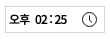

## 문제 
  
클릭 이벤트를 주었다. 그런데 클릭이 두 번 된다?

클릭 이벤트를 준 모든 태그가 두 번되는 것은 아니었고,   
내가 원하는 시간으로 설정한 하나의 TimePicker가 문제였다.  

TimePicker를 Init으로 기본 셋팅을 한다.

이 TimePicker를 원하는 시간으로 변경하고, TimePicker를 클릭 할 시에   
TimePickerList가 slideDown되어 보여지게된다.  
slideDown될 때 원하는 시간으로 스크롤의 위치가 변경이 되었으면 했는데
클릭이 두 번씩 되면서, 스크롤의 위치가 비정상적이었다.

## 💡 아이디어 -> 구글링

콘솔을 찍어보니, 두 번씩 찍히는게 이상했다.
이 클릭 이벤트가 중복으로 적용될 것이라고는 상상도 못한 것이다.  
그래서 구글링을 해 본 결과 내가 찾던 답이었다.  

https://velog.io/@heeboventure/jQuery-click-%EC%9D%B4%EB%B2%A4%ED%8A%B8-%EC%A4%91%EB%B3%B5-%EB%B0%9C%EC%83%9D-%EB%AC%B8%EC%A0%9C-%ED%95%B4%EA%B2%B0

#### 🔨 해결 요약

2개의 Timepicker를 만들었는데
click이벤트를 주는대로, 이벤트가 중복된다.
그러므로, click이벤트가 중복되지 않도록, 기존에 click 이벤트가 있으면 제거하는 

#### 1. off() - 이벤트 제거
    1) 모든 이벤트 제거
    $('#id').off().on('click', functionn(){})

    2) click이밴트만 제거
    $('#id').off('click').on('click', function(){})

#### 2. bind, unbind - 이벤트와 엮거나, 풀거나

>1) 클릭 이벤트 unbind
>$('#id').unbind('click');

>2) 클릭 이벤트 bind
>$('#id).bind('click', function(){});
