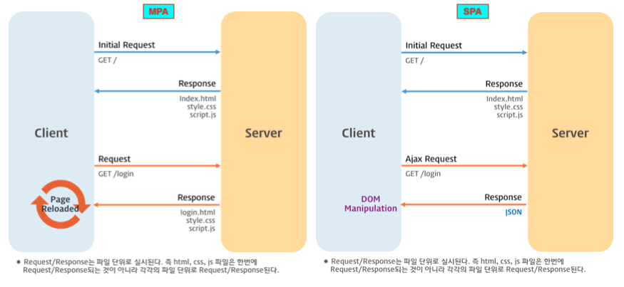

누군가 나한테 물어본 질문  

👨🏼‍🦱 : JSX를 쓰면 새로고침이 안되니까 이 JSX를 이용해서 데이터를 묶어둘 수 있지않아?  
🙋🏻‍♀️ : 네??? JSX는 그냥 문법일 뿐인데  

까지 얘기함; 새로고침은 JSX와 관련이 없습니다.하고 SPA를 멋드러지게 설명 하고싶었어요.  

## SPA(Single Page Application)
- 모든 정적 리소스를 최초 접근 시 단 한 번만 다운로드 한다. 
- 새로운 페이지 요청 시 페이지 갱신에 필요한 데이터만 JSON으로 전달받아 페이지를 갱신한다.
- 전체 페이지를 다시 렌더링하지 않고 변경되는 부분만 갱신하므로 새로고침이 발생하지 않는다.

SPA를 더 자세히 설명하기 위해서는 SPA의 반대인 MPA와 비교하여 설명하면 이해가 쉬울 것 같다.

## MPA(Multi Page Application)
- 새로운 페이지 요청 시 페이지 갱신에 필요한 완전한 리소스를 클라이언트에 응답한다.
- 응답을 받아, 렌더링하는 과정에서 새로고침이 발생한다.
- 각 페이지마다 고유의 URL이 존재한다.

>
즉, 과거의 웹사이트는 MPA로 이루어져있고, 요즘의 웹사이트는 SPA로 이루어져있다.  
첫 화면 로드 시 서버로부터 모든 정적 리소스를 다운로드 받아  
이벤트가 발생하거나 페이지가 변경될 시에는 최초에 로드된 자바스크립트를 통해 변경이 이루어지는 것이다.

## SPA의 라우팅
#### **🙊 라우팅이란**  
사용자가 요청한 URL을 해석하고 새로운 페이지를 전환하기 위한 데이터를 취득하기 위해 데이터를 서버에 요청하고 화면을 전환하는 일련의 행위를 말함.

1. Ajax  
비동기적으로 서버와 브라우저가 데이터를 교환할 수 있는 통신방식

2. Hash  
url의 hash가 변경되면 발생하는 hashchange 이벤트를 사용하여 ajax 요청을 수행

#### **🙊 SPA에 라우팅이 왜나와?**  
라우팅 시   
서버에서 페이지를 응답받아 화면을 렌더링을 할지(서버 사이드 렌더링),  
브라우저에서 자바스크립트를 활용해 화면을 렌더링할지(클라이언트 사이드 렌더링.)  
어떤 렌더링을 하느냐로 MPA(서버 사이드), SPA(클라이언트 사이드)를 구분할 수 있기 때문이죠.

